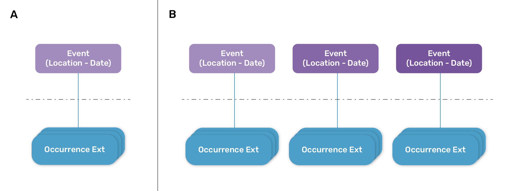
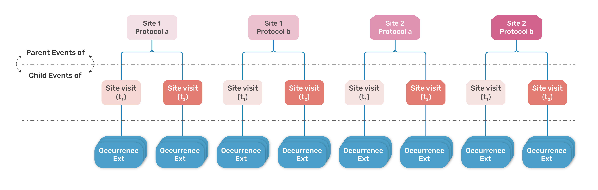
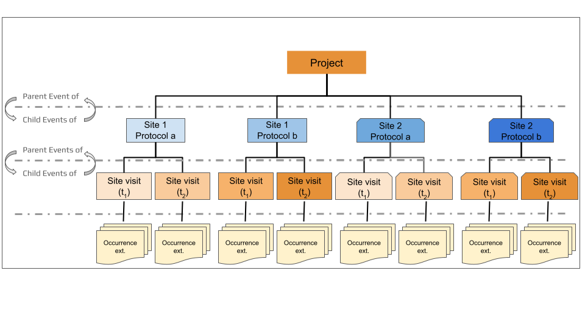
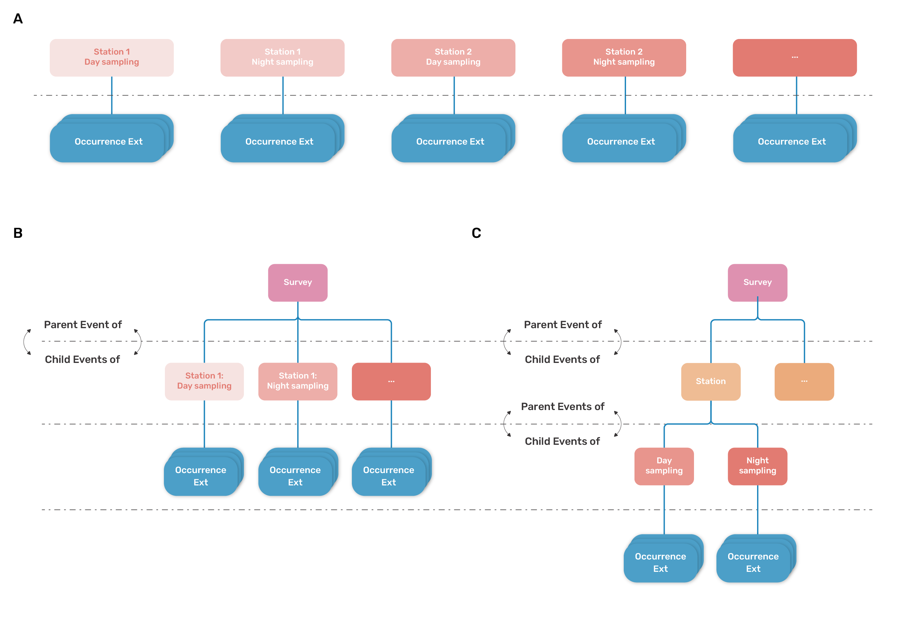
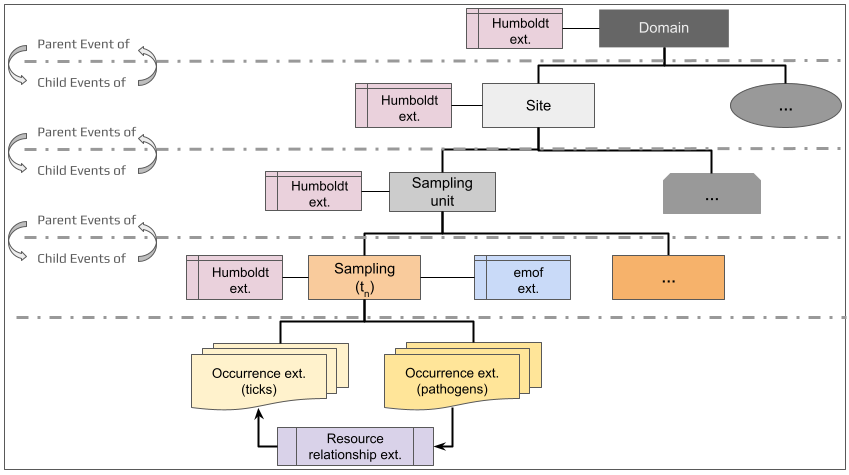

[[mapping-survey-data-to-dwc]]
== Mapping survey data to Darwin Core

The following sections will guide you through the
process of mapping your the Event-level (sampling context) information of your biodiversity survey data to the Darwin Core data standard.

In practice, the process of mapping survey and monitoring data to the
DwC standard for publication in GBIF would roughly follow these steps:

* *Identification of the structure, or hierarchy, of the data:* In essence, this
is the process of translating the sampling design of a biological survey
(or series of surveys) to Darwin Core event format. Does the dataset
consist of a single survey at a single location? Multiple surveys at
different times at the same location? Or a series of surveys at
different locations? See 'Translating survey design to DwC event data
structure' below. +
* *Identification of the data composition and DwC vocabulary needs:* Before actually mapping data to terms, it's useful to take some time to identify the
vocabulary extensions that will be necessary to report all data (or as
much data as possible) from the dataset. Available extensions can be explored via the https://rs.gbif.org/extensions.html[GBIF registered
extensions] and https://www.tdwg.org/standards/[TDWG biodiversity
information standards]. +
* *Mapping of survey (Event) information to DwC event terms:* Information about
each biological survey (simply referred to as an 'Event' or 'sampling
Event') will be mapped to https://dwc.tdwg.org/terms/#event[DwC Event
class] and https://eco.tdwg.org/terms/[Humboldt extension] terms and
saved in an `event` table or tables. Event-level data include the contextual
information that applies to all occurrence and ancillary data collected
or recorded during an event. Examples include information about the survey design,
site (e.g., location, date), protocol(s), scope(s), and sampling effort.
Resource: see the
https://github.com/gbif/doc-guide-publishing-survey-data/tree/1.0/data['event'
table in the data mapping template]. +
* *Mapping of occurrence data to the DwC occurrence extension:* Organism
occurrence information collected during biological surveys (e.g.,
scientific name, additional organismal information) will be shared in an
independent 'occurrence' table using the
https://rs.gbif.org/core/dwc_occurrence_2024-02-23.xml[occurrence
extension]. See the
https://github.com/gbif/doc-guide-publishing-survey-data/tree/1.0/data['occurrence'
table in the data mapping template]. +
* *Mapping of ancillary data to appropriate extensions:* Additional information
collected during the survey that require use of one or more extensions
should be mapped so as to link the information to the appropriate events
or organisms via the relevant event identifiers.

As previously mentioned, some data cannot yet be published to GBIF with
a DwC event dataset. But, the landscape of biodiversity data in GBIF is
always evolving. That is to say, the GBIF infrastructure is not static
and maintains a consistent focus on stepwise efforts to improve the
flexibility of the underlying data model and expand the breadth of data
types and complexity that can be accommodated. Data that cannot be
published currently may be accepted later. As such, mapping as much data
as possible now reduces the amount of time and energy spent overall,
removing the need to revisit the process at a later date.

*The recommended best practice is to map as much of your data as
possible using all existing vocabulary standards and extensions
necessary for your data*.

=== Translating survey design into Darwin Core event structure

*Biological survey design*, or the sampling structure of a biological
survey, varies widely and identifying how surveys relate to a DwC event
is the most difficult part of mapping a dataset. DwC defines an event as
’_an action that occurs at some location during some time’_, such as a
specimen collection process, a camera trap image capture, or a marine
trawl. This broad definition of event means biological surveys can be
framed as a single event or as a series of Events nested within Events using a
Parent-Child relationship as necessary. The *sampling event hierarchy* is the translation of the survey sampling 
design into an event-based perspective using Darwin Core.

=== Non-nested datasets

*Non-nested datasets* are datasets reflecting a simple or flat survey design structure (<<fig1, Figure 1>>). These are typically simple datasets consisting of:

* a single sampling event occurring at a particular place and time and conducted using a single standardized sampling protocol that is not repeated and is not necessarily part of a spatially larger sampling schema (Figure 1a), or +
* a series of single sampling events that are not joined by a larger parent Event (Figure 1b). A compilation dataset (combination of unrelated surveys, compiled data sources and/or literature searches, see Biological survey data section) could be a special case of non-nested dataset where there is a unique Event level that describes the compilation itself (e.g., the broad area where multiple surveys are aggregated), which results in several occurrences.

[[fig1]]
.A simple schematic of a non-nested Event dataset (a) consisting of a single Event with associated Occurrences related to the Event via the Occurrence extension or (b) a series of individual Events with associated Occurrences related to the appropriate Event via the Occurrence extension. 

=== Nested datasets

*Nested datasets* use parent-child relationships to capture information collected through more complex survey design, such as datasets resulting from repeated sampling events and/or multiple sampling protocols. Creating nested Event levels may be important to relating the full story a dataset has to tell and to facilitating downstream analysis of the data.

[NOTE] 
.*In a nested dataset:*
==== 
* All Events *_except those at the lowest Event level_* are considered the *parent Event* to any Event(s) beneath it. These *child Events* may represent either multiple sampling sites, protocols, or repeated sampling at the same locality using the same protocol. The top-most Event level does not have a parent Event. +
* *_A parent Event MUST encompass its child Events spatially and temporally._* Specifically, the spatial extent and temporal interval of a parent Event MUST contain the spatial extents and temporal intervals of all of its children (see Section 3.2.1 Principle of spatiotemporal coverage  in https://eco.tdwg.org/hierarchy/#321-principle-of-spatiotemporal-coverage[Properties of hierarchical events in the Humboldt Extension for Ecological Inventories^]).
* *_Each Event level should reflect a meaningful ecological or operational unit (e.g., spatial, temporal, or ecological scale) in the survey design._* An Event level should be added if the addition of that Event level will  facilitate data interpretation, downstream analysis, and/or linkage of information across datasets/data sources. *Do not create Event levels that are not necessary.* +
* Higher Event levels should include information that applies to all subsequent and lower Events. +
* Child-most Event level represents an Event that implements a single, reported sampling protocol at a single site  at a particular interval of time.

Refer to https://eco.tdwg.org/hierarchy/[Properties of hierarchical events in the Humboldt Extension for Ecological Inventories] (TDWG Humboldt Extension Task Group, 2024) for more information about creating nested data structures for Darwin Core datasets.
====

The goal in establishing the dataset structure is to keep it as simple as possible while representing the survey design as accurately as possible. *There is no single correct dataset structure,* and identifying the data structure most appropriate for a dataset may not always be a straightforward process. However, structure is most commonly defined as a function of sampling location, protocol, and date. 

==== Simple nested data structures

Consider a survey that implements two sampling protocols at two sites with multiple site visits for each unique site-protocol combination. This dataset could be structured with two Event levels as shown in <<fig2, Figure 2>>. Here, the highest event level will have four events representing each unique site-protocol combination: Site 1–Protocol a, Site 1–Protocol b, Site 2–Protocol a, Site 2–Protocol b. Events at the lowest event level will  be site visits that occur on a particular date for each site-protocol combination. Organismal Occurrence information collected during a site visit will be linked to the relevant site visit. This two Event level structure represents the simplest possible nested dataset structure, with only a single level of nesting.

[[fig2]]
[caption="Figure 2. "]
.Simplified example schematic of a nested Event dataset consisting of a series of surveys conducted at two sites (Site 1 and Site 2) with two distinct sampling protocols (Protocol a, Protocol b) represented by the blue boxes. Each protocol is implemented at each site on two different dates (Site visit t1, Site visit t2) with associated Occurrences related to the appropriate Event via the Occurrence extension (yellow boxes). 

It is ideal to structure a dataset such that each implemented protocol and unique site location should be established as a specific Event such that it is clear what protocol was implemented where to capture the Occurrence or other information connected to the lowest Event level. However, it is not always possible to disentangle information collected using multiple protocols.

==== Simple nested datasets with Project-level information

Datasets that are collected as part of a larger or established network or project should report as much contextual information as possible to capture information about the project or network or specifically stated survey scope(s).

Project-level information will always be shared at the highest event level. This can be achieved in one of two ways:

* By embedding project-level information within the highest existing survey Event level. With the dataset presented in <<fig2, Figure 2>>,  project-level information would be included with each of the four Site–Protocol Events. +
* By introducing a new parent Event level above all existing Events, dedicated to capturing project-level context. In the context of the example dataset presented in <<fig2, Figure 2>>, this would mean adding a third Event level to the dataset structure that is parent to the Site–Protocol event level. The structure with this additional top-level Event is illustrated in <<fig3, Figure 3>>. 

[[fig3]]
[caption="Figure 3. "]
.Simplest nested hierarchy with an additional event level to consolidate all survey Events under the context of a project (orange box).

==== Deeply nested datasets

Although the recommendation is to keep dataset structure as simple as possible, more complex nesting may be necessary to accurately represent survey design and support data reuse. Added complexity can improve clarity when:

* multiple protocols are implemented within the same survey framework, +
* survey outputs include a mix of data types (e.g., specimen collections, field observations, observed relationships), +
* collected material contributes to downstream products (e.g., lab measurements, voucher specimens, media representations), or +
* relationships among datasets need to be preserved or exposed.

[[fig4]]
[caption="Figure 4. "]
.Three potential simple schematics for a zooplankton survey conducted at 20 stations, each sampled once during the day and once at night: non-nested (a), simple nested (b), and complex or deeply  nested (c).

Consider the dataset https://obis.org/dataset/96844ba5-08c1-4299-b778-0db31986b669[Krill along the 110°E meridian: Oceanographic influences on assemblages in the eastern Indian Ocean, RV Investigator voyage IN2019_V03 (2019)], published by OBIS-Australia. The dataset contains information about a zooplankton survey conducted by the https://ror.org/01mae9353[CSIRO Marine National Facility] in the eastern Indian Ocean in 2019. The survey consisted of daytime and nighttime sampling at 20 locations (stations) along an established transect. This dataset could be structured as a non-nested dataset or as nested dataset; and, as a nested dataset, the structure could be simple or more complex or more deeply nested with more than two Event levels.  

* Non-nested dataset structure (Figure 4a): As a non-nested dataset each sampling at a particular station at a particular date and time would be a unique Event  with no obvious link to other Events in the dataset beyond being part of the same dataset. Implementing this structure is the simplest approach to sharing data from the survey, however, without any nesting of Events, it may be difficult for data users to understand the relationships between survey Events. +
* Simple nested dataset structure (Figure 4b): As a simple nested dataset, the data structure would consist of two Event levels with the highest Event level capturing information about the overall cruise or campaign (gray box) and second Event level represents the daytime and nighttime sampling events at each station as a series of unique Events (orange boxes). +
* Deeply nested dataset structure (Figure 4c): As a more deeply nested dataset, the structure would consist of three Event levels such that the highest Event level represents the Survey (that is, the overall cruise or campaign; gray box), the middle Event level represents each of the 20 survey stations (blue boxes), and the lowest Event level represents the daytime and nighttime sampling events at each station (orange boxes. Note that the child Events of each parent Event are used to report independent replicates of the same type within the same parent Event and/or to preserve individual sampling units. 

If the survey was a unique event, this simpler two Event level structure would likely suffice. However, the stations sampled during the survey are standard sampling locations used in other survey efforts. To make it easier to link information from this dataset to others conducted at the same localities, a more complex nested structure was deemed appropriate. 

==== Constructing a dataset schematic
Some datasets may be very simple and have no hierarchical structure (**non-nested datasets**) with singular observations of individual taxa at a single location. Others may be complex and hierarchically structured (**nested datasets**), with a series of nested survey events (e.g., sampling designs with traps within plots within sites). Multiple structural scenarios may fit a dataset, particularly for more complex data resulting from ongoing monitoring or repeated sampling efforts. We recommend keeping the structure as simple as possible. Refer to https://eco.tdwg.org/hierarchy/[Properties of hierarchical events in the Humboldt Extension for Ecological Inventories] for additional guidance on how to capture the details of nested observations (dwc:Event hierarchies).  

Creating a schematic of the dataset hierarchical structure such as in Figures 1-4 is particularly useful in exploring and effectively capturing survey design that generated the data collected (see also Figure 1 of <<DePooter2017>>). Once the Event structure is identified, the schematic can be expanded to identify which extensions (e.g., Humboldt, ccurrence, extended measurement or fact) are necessary and where they will link. After, you can proceed with mapping your data to the https://rs.gbif.org/core/dwc_event_2024-02-19.xml[DwC Event Core] and the https://rs.gbif.org/extension/eco/Humboldt_2024-04-16.xml[Humboldt Extension for Ecological Inventories] as described in the following sections. 

As an example, the structure of an example nested dataset from the U.S. National Science Foundation's National Ecological Observatory Network (NEON), a long-term ecological data collection facility, is presented in <<fig5, Figure 5>>. This structure describes tick-pathogen data derived from two interconnected NEON datasets: https://data.neonscience.org/data-products/DP1.10093.001[Ticks sampled using drag cloths] <<NEON2025b>> and https://data.neonscience.org/data-products/DP1.10092.001[Tick pathogen status] <<NEON2025a>>. Converting to a deeply nested structure allows preservation of the associations between pathogen detections and their corresponding host ticks across collection areas, which would otherwise be separated across two non-nested datasets.

[[fig5]]
[caption="Figure 5. "]
.Generalized dataset structure for NEON biological datasets. The structure is deeply nested dataset to more precisely capture details about NEON´s standardized survey design. The locality component encompasses 3 hierarchical levels to highlight the shifts in spatial scope from ecoclimatic domains to sites to individual sampling units (gray boxes). Additional information about each location is shared using the Humboldt extension (pink boxes). For each sampling Event or survey conducted at a sampling unit (orange boxes), additional information about the Event is shared using the Humboldt extension (pink box) and the extended measurement or fact extension ('emof ext.', blue box). Occurrence information associated with a sampling Event is reported using two separate tables, one each for tick occurrence information and the second for pathogens identified in tick samples (yellow boxes), to simplify data reporting and to illustrate implementation of the resource relationship extension (purple box) used to link pathogens with the appropriate tick samples.

This structure is a general interpretation of the dataset and follows NEON’s standard survey design (Thorpe et al. 2016). The NEON system is broadly divided into 20 ecoclimatic domains across the United States and Puerto Rico. Across these domains, NEON has established a total of 81 field sites (47 terrestrial and 34 aquatic), which serve as representative sampling locations within each domain. Within each site, spatial sampling units, such as plots, segments, or reaches, are established based on the site type and the requirements of individual protocols. To simplify the burden in standardizing information across biological datasets, their biological datasets are structured such that locality information (domain, site, sampling unit) is contained in the highest three event levels and information specific to individual site visits is reported at the lowest event levels ((<<fig5, Figure 5>>)). At each sampling Event, information about the sampling context is reported using https://rs.gbif.org/core/dwc_event_2024-02-19.xml[DwC Event core] and https://eco.tdwg.org/[Humboldt extension] terms. Information that cannot be reported using those terms is reported using the https://rs.gbif.org/extension/obis/extended_measurement_or_fact_2023-08-28.xml[extended measurements or facts (emof) extension]. This is the information that is least likely to change through time and would make it easier to aggregate information across their own datasets. Depending on data collected, other extensions can also be added, such as the https://rs.gbif.org/extension/gbif/1.0/multimedia.xml[simple multimedia extension] or the https://rs.gbif.org/extension/gbif/1.0/dna_derived_data_2024-07-11.xml[DNA-derived data extension].

Note that in this example that reporting of occurrence information is illustrated using two instances of the https://rs.gbif.org/core/dwc_occurrence_2024-02-23.xml[occurrence extension], one for ticks and another for pathogens. While Occurrence information is most commonly shared using a single table, it can be shared using multiple tables. For the purposes of preparing this dataset as a case study for the guide, tick and pathogen Occurrence data were kept separate to more clearly illustrate that pathogen records are derived from samples collected from the ticks. This relationship is communicated using the https://rs.gbif.org/extension/resource_relationship_2024-02-19.xml[resource relationship extension]. 

<<<
