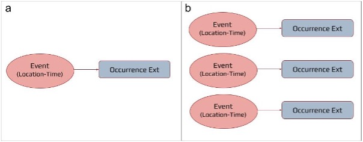
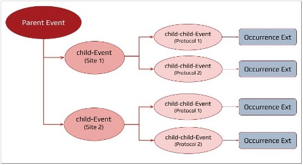
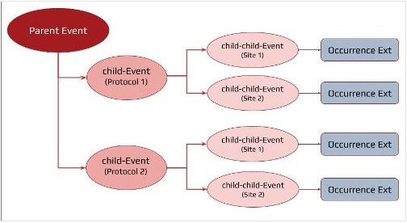

[[mapping-survey-data-to-dwc]]
== Mapping survey data to Darwin Core

*Data mapping* is the process of matching fields from one database to
another with the intention of facilitating integration with data from
heterogeneous sources. The following sections will guide you through the
process of mapping your biodiversity survey data to the Event-level
content of biological survey data to biodiversity data standards.

In practice, the process of mapping survey and monitoring data to the
DwC standard for publication in GBIF would roughly follow these steps:

* *Identify the structure, or hierarchy, of the data:* In essence, this
is the process of translating the sampling design of a biological survey
(or series of surveys) to Darwin Core event format. Does the dataset
consist of a single survey at a single location? Multiple surveys at
different times at the same location? Or a series of surveys at
different locations? See `Translating survey design to DwC event data
structure' below. +
* *Identify data composition and DwC vocabulary needs:* Identify the
vocabulary extensions that will be necessary to report all data (or as
much data as possible) from the dataset. Refer to GBIF registered
extensions (https://rs.gbif.org/extensions.html) and TDWG biodiversity
information standards (https://www.tdwg.org/standards/). +
* *Map survey (Event) information to DwC event terms:* Information about
each biological survey (simply referred to as an `Event' or `sampling
Event') will be mapped to https://dwc.tdwg.org/terms/#event[DwC Event
class] and https://eco.tdwg.org/terms/[Humboldt extension] terms and
saved in an independent `event' table. This is the contextual
information that applies to all occurrence and ancillary data collected
or recorded during an event such as information about the survey design,
site (e.g., location, date), protocol(s), scope(s), and sampling effort.
Resource: see the
https://docs.google.com/spreadsheets/d/1A5wvy-zK7zl2eL79QOeADkbtPQXQtHUl/edit?usp=sharing&ouid=100202681437108536507&rtpof=true&sd=true[`event'
tab in the template]. +
* *Map occurrence data to the DwC occurrence extension:* Organism
occurrence information collected during biological surveys (e.g.,
scientific name, additional organismal information) will be shared in an
independent `occurrence' table using the
https://rs.gbif.org/core/dwc_occurrence_2024-02-23.xml[occurrence
extension]. Resource: see the
https://docs.google.com/spreadsheets/d/1A5wvy-zK7zl2eL79QOeADkbtPQXQtHUl/edit?usp=sharing&ouid=100202681437108536507&rtpof=true&sd=true[`occurrence'
tab in the template]. +
* *Map ancillary data to appropriate extensions:* Additional information
collected during the survey that require use of one or more extensions
should be mapped so as to link the information to the appropriate events
or organisms via the relevant event identifiers.

As previously mentioned, some data cannot yet be published to GBIF with
a DwC event dataset. But, the landscape of biodiversity data in GBIF is
always evolving. That is to say, the GBIF infrastructure is not static
and maintains a consistent focus on stepwise efforts to improve the
flexibility of the underlying data model and expand the breadth of data
types and complexity that can be accommodated. Data that cannot be
published currently may be accepted later. As such, mapping as much data
as possible now reduces the amount of time and energy spent overall,
removing the need to revisit the process at a later date.

*The recommended best practice is to map as much of your data as
possible using all existing vocabulary standards and extensions
necessary for your data*.

[IMPORTANT] 
.Data Mapping Tips
====
Populate all terms for which information is available. 

Each term in this document is linked with its respective term internationalized resource identifier (IRI) alias (ex., http://rs.tdwg.org/eco/terms/protocolNames[_eco:protocolNames_]). Always use these links to refer to the definition, comments, and examples
provided when populating a term. 

*Paired terms*, mutually exclusive sets of terms, must be populated together. Often these terms are designed to offer the data publisher some level of flexibility in reporting data. Paired terms are most common in terms available for reporting a variable value and associated unit of measure (for example, http://rs.tdwg.org/dwc/terms/sampleSizeValue[_dwc:sampleSizeValue_] and http://rs.tdwg.org/dwc/terms/sampleSizeUnit[_dwc:sampleSizeUnit_]). 

*No data, missing data, and data values of '0'*

  * Cells with a value of '0' should be populated as '0'.
  * Cells with missing data or NULL values should be left empty. 
  * Terms for which there is no data to share at any hierarchical level can be excluded from the data table.
====

=== Translating survey design into Darwin Core event structure

*Biological survey design*, or the sampling structure of a biological
survey, varies widely and identifying how surveys relate to a DwC event
is the most difficult part of mapping a dataset. DwC defines an event as
’_An action that occurs at some location during some time’_, such as a
specimen collection process, a camera trap image capture, or a marine
trawl. This broad definition of event means biological surveys can be
framed as a single event or as a series of Events within Events using a
Parent-Child relationship as necessary. The *sampling event hierarchy*
is the translation of the survey sampling design into an event-based
perspective using Darwin Core terms capturing each spatiotemporally
unique sampling event as a DwC event.

=== Non-nested datasets

*Non-nested datasets* are datasets reflecting a flat survey design
structure (Figure 1). These are typically simple datasets consisting of:

* a single sampling event occurring at a particular place and time and
conducted using a single standardized sampling protocol that is not
repeated and is not part of a spatially larger sampling schema (Figure
4a), or +
* a series of single sampling events that are not joined by a larger
parent event. A compilation dataset (combination of surveys, compiled
data sources and/or literature searches, see Biological survey data
section) could be a special case of non-nested dataset where there is a
unique event level that describes the compilation itself (e.g the broad
area where multiple surveys are aggregated) which results in several
occurrences.

.A simple schematic of a non-nested event dataset structure (a) consisting of a single event with associated occurrences related to the event via the occurrence extension and (b) a series of individual events with associated occurrences related to the appropriate event via the occurrence extension. 

=== Nested datasets

*Nested datasets* can capture more complex survey designs, for example,
those consisting of repeated sampling events and/or multiple sampling
protocols. The top-most event level is the `**parent Event.**' A parent
event encompasses all other Events in the dataset. Subsequent Events
(*child Events*) represent either multiple sampling sites, protocols, or
repeated sampling at the same locality using the same protocol. For any
given term, a parent event should encompass the full scope of values
contained in all of its child Events (see details in
http://rs.tdwg.org/dwc/doc/hierarchy/2024-02-28[Hierarchical Events in
Humboldt Extension for Ecological Inventories] document).

The structure of nested datasets can take various forms, but most
commonly are structured as a function of sampling location, protocol,
and date.

* *Locality–protocol:* center first around study site second and
secondarily on protocol (Figure 5a) *locality 🡪 sampling protocol 🡪
occurrence* +
* *Protocol–locality:* or conversely, focusing on protocol at higher
hierarchical levels and secondarily on locality (Figure 5b) .. *protocol
→ locality → occurrence* emphasizes taxonomic scope at higher levels +
* *Time-series:* Time-series datasets are temporally nested datasets
(Figure 5c)

[caption="Figure 2a. "]
.Simplified example schematic of a nested event dataset structure representing a survey (Parent Event, dark red oval) with two survey sites (child-Events, medium red ovals) at each of which two protocols (child-child-Events, light red ovals) are implemented and occurrence information is collected and related to each sampling event using the occurrence extension. 

[caption="Figure 2b. "]
.Simplified example schematic of a nested event dataset structure representing a survey (Parent Event, dark red oval) with two protocols (child-Events, medium red ovals) which are each implemented at two survey sites (four independently surveyed child-child-Events, light red ovals) wherein occurrence information is collected in four occurrences lists and related to each sampling event using the occurrence extension.

[caption="Figure 2c. "]
.Simplified example schematic of a nested event dataset structure representing a time series survey (Parent Event, dark red oval) with two survey sites (child-Events, medium red ovals) which are each independently sampled at two different times (four independently surveyed child-child-Events, light red ovals) wherein occurrence information is collected in four occurrences lists and related to each sampling event using the occurrence extension.

==== Constructing a dataset schematic

Some datasets may be very simple and have no hierarchical structure
(*non-nested datasets*) with singular observations of individual taxa at
a single location. Others may be complex and hierarchically structured
(*nested datasets*), with a series of nested survey events (e.g.,
sampling designs with traps within plots within sites). Multiple
structural scenarios may fit a dataset, particularly for more complex
data resulting from ongoing monitoring or repeated sampling efforts. We
recommend keeping the structure as simple as possible. Additional
guidance on how to capture the details of nested observations (dwc:Event
hierarchies) is available in https://eco.tdwg.org/hierarchy/[Properties
of hierarchical events in the Humboldt Extension for Ecological
Inventories].

Creating a schematic of the dataset hierarchical structure such as in
Figures 1 and 2 is particularly useful in exploring and effectively
capturing survey design that generated the data collected (see also
Figure 1 of <<DePooter2017>>). Once the event structure is
identified, the schematic can be expanded to identify which extensions
(e.g., Humboldt, occurrence, extended measurement or facts) are
necessary and where they will link to. After, you can proceed with
mapping your data to the
https://docs.google.com/document/d/1v_CpHj4C8xHF3mFfmRbcIBZ5pRAjJ-hzTZcBWzsnQOs/edit#heading=h.xx2n2qywocd7[DwC
event Core] and the
https://rs.gbif.org/extension/eco/Humboldt_2024-04-16.xml[Humboldt
Extension for Ecological Inventories] as described in the following
sections.

<<<
