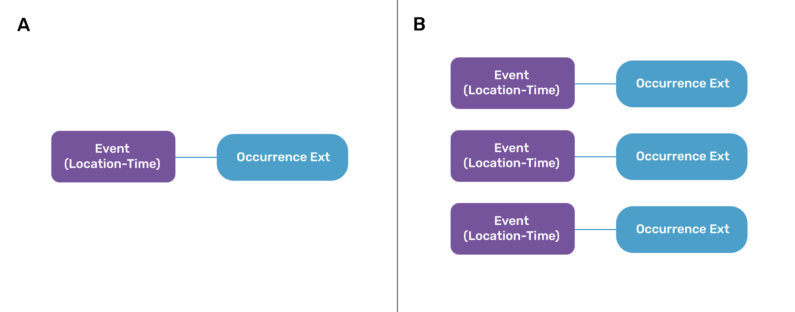
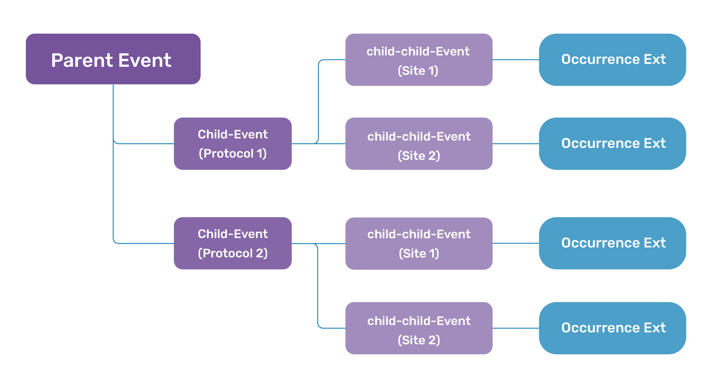

[[mapping-survey-data-to-dwc]]
== Mapping survey data to Darwin Core

The following sections will guide you through the
process of mapping your the Event-level (sampling context) information of your biodiversity survey data to the Darwin Core data standard.

In practice, the process of mapping survey and monitoring data to the
DwC standard for publication in GBIF would roughly follow these steps:

* *Identification of the structure, or hierarchy, of the data:* In essence, this
is the process of translating the sampling design of a biological survey
(or series of surveys) to Darwin Core event format. Does the dataset
consist of a single survey at a single location? Multiple surveys at
different times at the same location? Or a series of surveys at
different locations? See 'Translating survey design to DwC event data
structure' below. +
* *Identification of the data composition and DwC vocabulary needs:* Before actually mapping data to terms, it's useful to take some time to identify the
vocabulary extensions that will be necessary to report all data (or as
much data as possible) from the dataset. Available extensions can be explored via the https://rs.gbif.org/extensions.html[GBIF registered
extensions] and https://www.tdwg.org/standards/[TDWG biodiversity
information standards]. +
* *Mapping of survey (Event) information to DwC event terms:* Information about
each biological survey (simply referred to as an 'Event' or 'sampling
Event') will be mapped to https://dwc.tdwg.org/terms/#event[DwC Event
class] and https://eco.tdwg.org/terms/[Humboldt extension] terms and
saved in an `event` table or tables. Event-level data include the contextual
information that applies to all occurrence and ancillary data collected
or recorded during an event. Examples include information about the survey design,
site (e.g., location, date), protocol(s), scope(s), and sampling effort.
Resource: see the
https://github.com/gbif/doc-guide-publishing-survey-data/tree/1.0/data['event'
table in the data mapping template]. +
* *Mapping of occurrence data to the DwC occurrence extension:* Organism
occurrence information collected during biological surveys (e.g.,
scientific name, additional organismal information) will be shared in an
independent 'occurrence' table using the
https://rs.gbif.org/core/dwc_occurrence_2024-02-23.xml[occurrence
extension]. See the
https://github.com/gbif/doc-guide-publishing-survey-data/tree/1.0/data['occurrence'
table in the data mapping template]. +
* *Mapping of ancillary data to appropriate extensions:* Additional information
collected during the survey that require use of one or more extensions
should be mapped so as to link the information to the appropriate events
or organisms via the relevant event identifiers.

As previously mentioned, some data cannot yet be published to GBIF with
a DwC event dataset. But, the landscape of biodiversity data in GBIF is
always evolving. That is to say, the GBIF infrastructure is not static
and maintains a consistent focus on stepwise efforts to improve the
flexibility of the underlying data model and expand the breadth of data
types and complexity that can be accommodated. Data that cannot be
published currently may be accepted later. As such, mapping as much data
as possible now reduces the amount of time and energy spent overall,
removing the need to revisit the process at a later date.

*The recommended best practice is to map as much of your data as
possible using all existing vocabulary standards and extensions
necessary for your data*.

=== Translating survey design into Darwin Core event structure

*Biological survey design*, or the sampling structure of a biological
survey, varies widely and identifying how surveys relate to a DwC event
is the most difficult part of mapping a dataset. DwC defines an event as
’_an action that occurs at some location during some time’_, such as a
specimen collection process, a camera trap image capture, or a marine
trawl. This broad definition of event means biological surveys can be
framed as a single event or as a series of Events nested within Events using a
Parent-Child relationship as necessary. 

The *sampling event hierarchy* is the translation of the survey sampling 
design into an event-based perspective using Darwin Core.

=== Non-nested datasets

*Non-nested datasets* are datasets reflecting a simple survey design
structure (<<fig1, Figure 1>>). These datasets typically consist of:

* a single sampling event occurring at a particular place and time and conducted using a single standardized sampling protocol that is not repeated and is not necessarily part of a spatially larger sampling schema (Figure 4a), or +
* a series of single sampling events that are not joined by a larger parent event. A compilation dataset (combination of surveys, compiled data sources and/or literature searches, see Biological survey data section) could be a special case of non-nested dataset where there is a unique event level that describes the compilation itself (e.g the broad area where multiple surveys are aggregated) which results in several occurrences.

[[fig1]]
.A simple schematic of a non-nested event dataset (a) consisting of a single event with associated occurrences related to the event via the occurrence extension or (b) a series of individual events with associated occurrences related to the appropriate event via the occurrence extension 

=== Nested datasets

*Nested datasets* use parent-child relationships to capture information collected through more complex survey design, such as datasets resulting from repeated sampling events and/or multiple sampling protocols. Creating nested event levels may be important to relating the full story a dataset has to tell and to facilitating downstream analysis of the data. In a nested dataset:

* The top-most Event level does not have a parent event. +
* The highest event levels should include more general information that applies to all subsequent and lower events. +
* All events *_except the lowest Event level_* are considered the **parent Event** to any event(s) beneath it. These **child events** may represent either multiple sampling sites, protocols, or repeated sampling at the same locality using the same protocol. +
* The child-most event level represents an event that implements a single, reported sampling protocol at a single site  and unique date. + 
* For any given term, a parent event should encompass the full scope of values contained in all of its child Events (see details in http://rs.tdwg.org/dwc/doc/hierarchy/2024-02-28[Hierarchical Events in Humboldt Extension for Ecological Inventories] document).

==== General nested data structures

There is no single correct dataset correct structure; and, identifying the data structure most appropriate for a dataset may not always be a straightforward process. However, structure is most commonly defined as a function of sampling location, protocol, and date. 

If possible, it is ideal to structure a dataset such that each implemented protocol and unique site location should be established as a specific event such that it is clear what protocol was implemented where to capture the occurrence or other information connected to the lowest event level. However, it is not always possible to disentangle information collected using multiple protocols.

**Locality–Protocol-Date**

This structure establishes location, or survey site, at the highest event levels. Subsequent events center around sampling protocols such that the lowest or child-most event level would consist of visits to a specific site, implementing a specific protocol, at a unique date/time (Figure 2A). In this example, there are two survey sites (Site 1 and Site 3) with two protocols (Protocol a and Protocol b) implemented at each site. Each site is visited twice and sampled using one of the protocols. 

* The two survey sites are established at the highest event level. All information provided at this level will be inherited by the child events nested below it. +
** Site 1 + 
** Site 3

* The next event level will consist of a unique event for each sampling protocol implemented beneath each site location. Because Protocol a and Protocol b are implemented at Sites 1 and 3, they are established as unique child events under both sites. Each of these four events is a: child event to one of the two site events and parent event to two site visit events. +
** Site 1 - Protocol a +
** Site 1 - Protocol b +
** Site 3 - Protocol a +
** Site 3 - Protocol b 

* The lowest event level is a series of events that represent a visit to a specific site implementing one protocol on a unique date. +
** Site 1 - Protocol a - date 1 +
** Site 1 - Protocol a - date 2 +
** Site 1 - Protocol b - date 1 +
** Site 1 - Protocol b - date 2 +
** Site 3 - Protocol a - date 1 +
** Site 3 - Protocol a - date 2 +
** Site 3 - Protocol b - date 1 +
** Site 3 - Protocol b - date 2

* Organismal occurrence information collected during a site visit will be linked to the relevant site visit.

[[fig2a]]
[caption="Figure 2A. "]
.Simplified example schematic of a nested event dataset structure representing a survey (parent Event, dark purple rectangles) with two distinct survey sites (child-Events, medium purple rectangles). At each survey site, two sampling protocols are implemented (child-child-Events, light purple rectangles) and occurrence information is collected and related to each sampling event using the occurrence extension (blue rectangles). 

**Protocol–Locality-Date**

This structure establishes sampling protocol at the highest event levels. Subsequent events are thus centered around location, or survey site, and date. The lowest or child-most event level would consist of visits to a specific site, implementing a specific protocol, at a unique date/time (Figure 2B). In this example, two sampling protocols (Protocol a and Protocol b) implemented are two of four survey sites: Protocol a is implemented at Site 1 and Site 3 and Protocol b is implemented at Site 2 and Site 4. Each site is visited twice and sampled using one of the protocols. 

* The two sampling protocols established at the highest event level. All information provided at this level will be inherited by the child events nested below it. 
** Protocol a +
** Protocol b
* The next event level … each site location at which each protocol is implemented. Protocol a is implemented at Sites 1 and 3, so Site 1 and Site 3 are established as child events to Protocol a. Protocol b is implemented at Sites 2 and 4, so Site 1 and Site 4 are child events to Procol b. Each of these four events is a: child event to one of the two protocol events and parent event to two site visit events.´+
* The lowest event level is a series of events that represent a visit to a specific site implementing one protocol on a unique date: +
** Protocol a - Site 1 - date 1 +
** Protocol a - Site 1 - date 2 +
** Protocol a - Site 3 - date 1 +
** Protocol a - Site 3 - date 2 +
** Protocol b - Site 2 - date 1 +
** Protocol b - Site 2 - date 2 +
** Protocol b - Site 4 - date 1 +
** Protocol b - Site 4 - date 2 +
* Organismal occurrence information collected during a site visit will be linked to the relevant site visit.

[[fig2b]]
[caption="Figure 2B. "]
.Simplified example schematic of a nested event dataset structure representing a survey (parent Event, dark purple rectangles) with two distinct sampling protocols (child-Events, medium purple rectangles) implemented at two sites (child-child-Events, light purple rectangles) wherein organismal occurrence information is collected and related to each sampling event using the occurrence extension (blue rectangles).

Figures 2A and 2B present only basic schematics capturing survey design in a nested event structure, but they should provide a starting point of how to think about this process of translating survey design into an hierarchical dataset structure. It may take some reflection on the data itself and exploration of different configurations to find the best fit. When attempting to identify the best structure for a dataset, it is useful to consider the following questions:

* Is there a structure that most effectively relates the  survey design? +
* Is there a domain-specific convention that should be applied? +
* Are there other aspects of the survey design that need to be taken into consideration, such as information about a project or broader network or specific survey scopes?

For datasets that are part of a larger or established network or project, there may be a need to include additional hierarchical levels to capture information about the project or network or specifically stated survey scope(s). Consider a long-term ecological research network  with a series of established monitoring sites which serve as the locations for repeated surveys where multiple protocols are implemented to capture information about one or more taxonomic or organisms of interest. 

Creating an Event level above protocol, location, and sampling date information may only be relevant for a dataset that is part of a larger project or network producing many datasets. Generally, if the additional event level will be useful in facilitating data discovery and relating multiple datasets, then consider including it. If it’s just another level of information that can easily be inferred from information recorded at lower event levels (e.g., repeated visits to a site that can be inferred from looking for identical locations in multiple records), then do not create the additional level.

[[fig3]]
[caption="Figure 3. "]
.Simplified example schematic of a nested event dataset structure representing a project (orange box) that includes a series of surveys conducted at at least one site (gray rectangles). Two survey scopes are targeted at each site (Scopes a and b, pink boxes). Two distinct sampling protocols (Protocol a1 and a2, blue boxes) are implemented in surveys targeting survey Scope a, and one protocol (Protocol b1) implemented in surveys targeting Scope b at each site on at least two different dates (Site visit t1 and Site visit t2, orange boxes) with associated occurrences related to the appropriate event via the occurrence extension (yellow boxes).
image::img/fig3.png[]

==== Constructing a dataset schematic
Some datasets may be very simple and have no hierarchical structure (**non-nested datasets**) with singular observations of individual taxa at a single location. Others may be complex and hierarchically structured (**nested datasets**), with a series of nested survey events (e.g., sampling designs with traps within plots within sites). Multiple structural scenarios may fit a dataset, particularly for more complex data resulting from ongoing monitoring or repeated sampling efforts. We recommend keeping the structure as simple as possible. Refer to https://eco.tdwg.org/hierarchy/[Properties of hierarchical events in the Humboldt Extension for Ecological Inventories] for additional guidance on how to capture the details of nested observations (dwc:Event hierarchies).  

Creating a schematic of the dataset hierarchical structure such as in Figures 1-3 is particularly useful in exploring and effectively capturing survey design that generated the data collected (see also Figure 1 of <<DePooter2017>>). Once the event structure is identified, the schematic can be expanded to identify which extensions (e.g., Humboldt, occurrence, extended measurement or facts) are necessary and where they will link. After, you can proceed with mapping your data to the DwC event Core and the Humboldt Extension for Ecological Inventories as described in the following sections. 

[[fig4]]
[caption="Figure 4. "]
.Generalized dataset structure for NEON biological datasets. The dataset implements a more complex version of the locality-protocol-date presented in Figure 2A where the ‘locality’ component encompassess 3 hierarchical levels to more distinctly capture specific information about NEON’s ecoclimatic domains, sites, and plots (gray boxes). For each site visit (orange boxes), or survey conducted at a plot, additional information about the event is shared using the Humboldt extension (purple box) and extended measurements or facts extension (emof, blue box). The occurrence information here is reported using two separate tables (yellow boxes) to simplify data reporting and to illustrate the implementation of the resource relationship extension (purple box).
image::img/fig4.png[]

As an example, the structure of an example dataset from the National Ecological Observatory Network (NEON) is presented in Figure 4. This dataset reports is tick-pathogen data derived from two NEON datasets–https://data.neonscience.org/data-products/DP1.10093.001[Ticks sampled using drag cloths] and https://data.neonscience.org/data-products/DP1.10092.001[Tick pathogen status]–to maintain the linkages between pathogens identified and the host ticks.

This structure is a general interpretation of the dataset and follows NEON’s standard survey design (Thorpe et al. 2016). The NEON system is broadly divided into 20 ecoclimatic ‘domains’ across the United States and Puerto Rico. These domains are then subdivided into a total of 81 field ‘sites’ (47 terrestrial and 34 aquatic). Each site is then partitioned into a series of  ‘plots’ using a prescribed protocol based on the site domain type (terrestrial or aquatic). To simplify the burden in standardizing information across biological datasets, their biological datasets are structured such that locality information (domain, site, plot) is contained in the highest three event levels and information specific to individual site visits is reported at the lowest event levels (Figure 4). At each site visit, additional information about the sampling context is reported using the Humboldt extension (https://eco.tdwg.org/) and additional information about the site that cannot be reported using https://rs.gbif.org/core/dwc_event_2024-02-19.xml[Event core] or https://eco.tdwg.org/[Humboldt extension] terms is reported using the https://rs.gbif.org/extension/obis/extended_measurement_or_fact_2023-08-28.xml[extended measurements or facts (emof) extension]. This is the information that is least likely to change through time and would make it easier to aggregate information across their own datasets.

Note that in this example that reporting of occurrence information is illustrated using two instances of the https://rs.gbif.org/core/dwc_occurrence_2024-02-23.xml[occurrence extension], one for ticks and another for pathogens. While occurrence information is most commonly shared using a single table, it can be shared using multiple tables. In the context of preparing this dataset for use as a case study with this guide, it was easier to keep tick and pathogen occurrence information separate because it makes it easier to illustrate that the pathogen occurrences were identified in samples taken from the ticks. This relationship is communicated using the https://rs.gbif.org/extension/resource_relationship_2024-02-19.xml[resource relationship extension]. 

<<<
