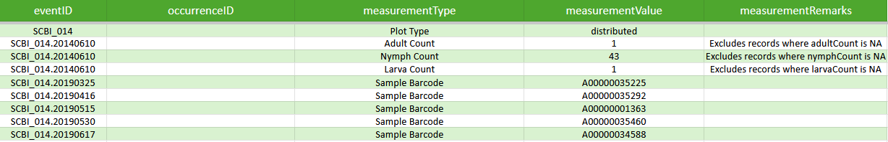
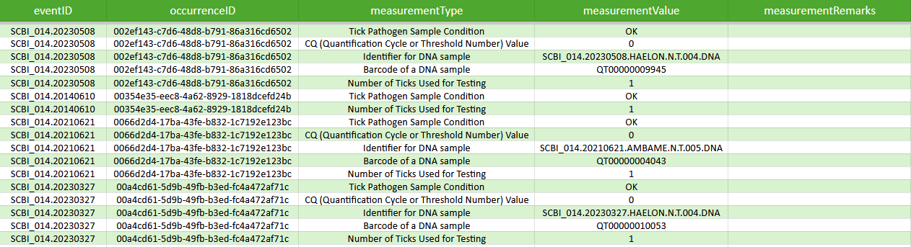

[[mapping-additional-survey-event-information:-dwc-extensions]]
== Mapping additional survey event information: DwC Extensions

=== Extended measurement or fact (eMoF) extension

Additional measurements about a site including values and units of measurement and related protocols can be shared for any Event using the extended measurement or fact extension (eMOF). The extension was developed by the https://obis.org/[Ocean Biodiversity Information System^] (OBIS), and detailed instructions about implementing the extension are available in the https://manual.obis.org/format_emof.html[OBIS manual^].

Specific information about the terms included in the emof extension (e.g., term names, definitions, and comments) is available in the https://rs.gbif.org/extension/obis/extended_measurement_or_fact_2023-08-28.xml[GBIF Repository of Schemas^].

[NOTE]
.*Using the https://rs.gbif.org/extension/obis/extended_measurement_or_fact_2023-08-28.xml[extended measurement or fact (emof) extension^]* 
====
- Create a new `emof` table
- Add term:dwc[dwc:eventID] as a column header. The dwc:eventID will link the record to the `event` table.
- Add each emof extension field needed as a column header. 
- Populate the relevant extension field(s) for each survey Event (term:dwc[dwc:eventID]) as necessary. 
====

****
[discrete]
==== Box. NEON tick-pathogen example dataset

The example dataset uses the emof extension to share a wide range of additional information about specific events including the NEON designated plot type where each site visit takes place (eventID = ‘SCBI_014’) and the number of individual adults, nymphs, and larvae associated with a specific sampling event (eventID = ‘SCBI_014.20140610’) or a sample barcode number associated with a sample collected during a site visit.

The example dataset also uses the emof extension to share additional information related to specific occurrences. Numerous occurrences in the dataset have multiple additional information types to report in order to ensure that all relevant and necessary information are retained. For example, a single occurrence can be linked directly to a categorical description of the tick pathogen sample condition, CQ value, an identifier for the associated DNA sample, and a barcode for the DNA sample.

****

=== Relevé extension

The https://rs.gbif.org/extension/gbif/1.0/releve_2016-05-10.xml[Relevé extension^] is designed to capture vegetation plot survey measurements at a survey site. The extension facilitates explicit reporting of:

* The description of the plant community associated the survey +
* Aspect and inclination at the survey site +
* Percent total cover of all plants and percent cover of trees, shrubs, herbs, cryptograms, mosses, lichens, algae, litter, water, and rocks +
* Heights of tree, shrub, and herbaceous layers +
* Whether or not mosses or lichens are identified

[NOTE]
.*Using the https://rs.gbif.org/extension/gbif/1.0/releve_2016-05-10.xml[Relevé extension^]* 
====
- Create a new `Relevé` table
- Add term:dwc[dwc:eventID] as a column header. The dwc:eventID will link the record to the `Event` table.
- Add each Relevé extension field needed as a column header. 
- Populate the relevant extension field(s) for each survey Event (term:dwc[dwc:eventID]) as necessary. Information for a unique term:dwc[dwc:eventID] should require only one row in the table.
====

For an example implementation of the https://rs.gbif.org/extension/gbif/1.0/releve_2016-05-10.xml[Relevé extension^], see the example dataset https://doi.org/10.15468/pkx4tg[Vegetation plots collected in dry grasslands throughout Bulgaria and Romanian Dobrudzha^].

<<<
